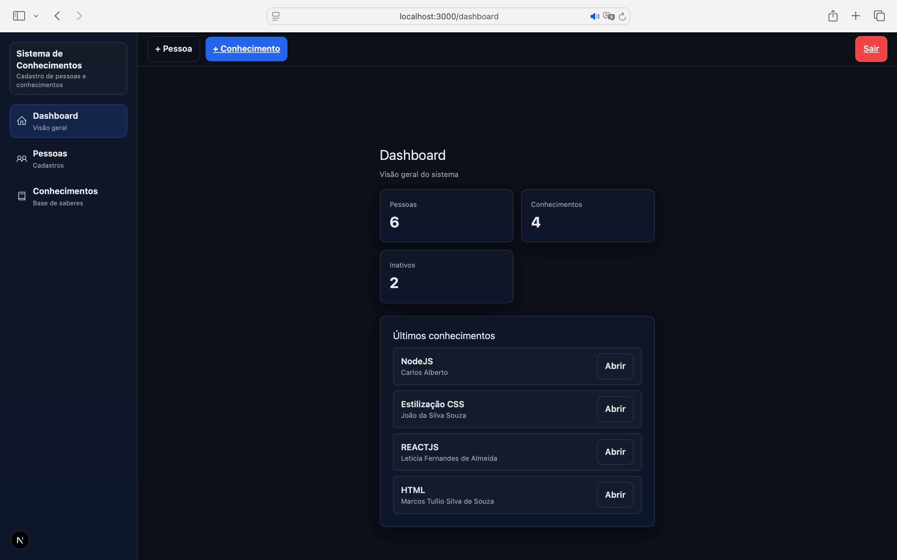

# Sistema de Trocas de Conhecimento

Aplicação web desenvolvida durante o Bootcamp Fullstack da Escola Avanti com o objetivo de permitir o cadastro, gerenciamento e visualização de conhecimentos oferecidos por pessoas da comunidade.

## Link YouTube: Demonstrativo do Sistema de Conhecimento

[Acesse o vídeo clicando aqui](https://youtu.be/tYmHf5Ou4kI)

# Sobre o Projeto

Este sistema foi desenvolvido para resolver o problema proposto no projeto do curso, que consiste na criação de uma plataforma para registro e organização de ofertas de conhecimento entre pessoas, facilitando a conexão entre quem deseja ensinar e quem deseja aprender.
A aplicação permite o cadastro de pessoas e conhecimentos associados, bem como o gerenciamento completo dessas informações.
O projeto foi estruturado em duas partes principais:

- backend/ — Responsável pela lógica da aplicação e persistência dos dados
- frontend/ — Interface do usuário e interação com a API

Cada parte possui seu próprio README com instruções detalhadas de configuração e execução.
O sistema atende a todos os requisitos obrigatórios do problema proposto, além de incluir funcionalidades adicionais consideradas como desafios opcionais.

> O problema consiste na criação de uma aplicação web para cadastro e gerenciamento de pessoas e ofertas de conhecimento, permitindo sua visualização e administração de forma simples e organizada -> [PDF da Problemática](<PROBLEMATICA DFS-2026.1-1.pdf>)

# Funcionalidades Implementadas

## Gestão de Pessoas

- Cadastro de pessoas
- Edição de dados
- Exclusão de registros

## Informações de contato e descrição

- Gestão de Usuários e Autenticação
- Cadastro de usuários do sistema
- Login com autenticação
- Controle de acesso às funcionalidades

## Gestão de Conhecimentos

- Cadastro de conhecimentos vinculados a uma pessoa
- Edição de informações
- Desativação de conhecimentos
- Exclusão de registros

## Dashboard

Interface com visão geral do sistema contendo:

- Quantidade de usuários cadastrados
- Quantidade de conhecimentos ativos
- Quantidade de conhecimentos inativos
- Lista dos conhecimentos registrados mais recentemente

# Tecnologias Utilizadas

## Backend

- Node.js
- Express
- Prisma ORM
- PostgreSQL
- Autenticação baseada em token

## Frontend

- React
- JavaScript
- Integração com API REST (fetch)
- Interface simples e funcional

# Banco de Dados

Foi utilizado um banco de dados relacional PostgreSQL para armazenamento das informações, conforme solicitado no projeto.
O backend inclui:
Modelagem das entidades
Migrações utilizando Prisma
Relacionamento entre pessoas e conhecimentos
Scripts para criação e atualização do banco

# Execução do Projeto

Para executar a aplicação completa, siga as instruções específicas nos READMEs:

- backend/README.md — Configuração do servidor e banco de dados
- frontend/README.md — Configuração da interface e integração com a API

# Status do Projeto

Versão funcional completa desenvolvida para entrega do Bootcamp, contemplando todos os requisitos obrigatórios e os desafios opcionais propostos.
