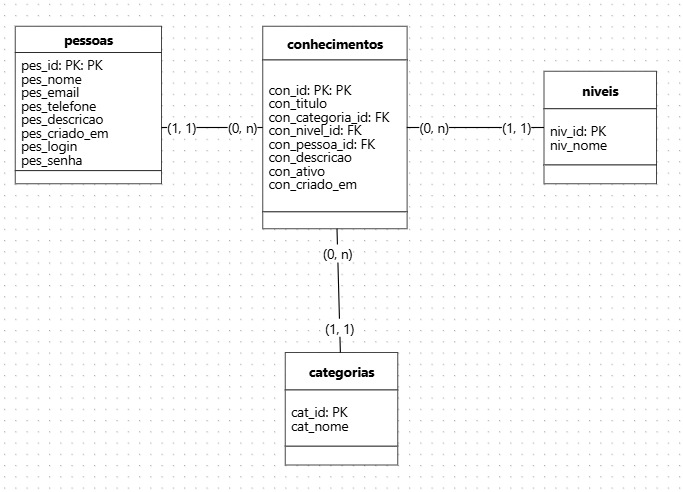

# projeto-bootcamp

## Modelagem do Banco de Dados – BD_REDE_CONHECIMENTO

Modelagem inicial do banco de dados da aplicação Rede de Trocas de Conhecimento, cujo objetivo é organizar o cadastro de pessoas e a publicação de ofertas de conhecimento para compartilhamento na comunidade.

A proposta visa atender aos requisitos funcionais do projeto, priorizando simplicidade, normalização e possibilidade de evolução futura.



### Visão Geral do Modelo

**pessoas** -> Responsável por armazenar os dados dos usuários da plataforma, incluindo informações pessoais e credenciais de acesso.

**conhecimentos** -> Entidade central do sistema, representa as ofertas de conhecimento disponibilizadas por uma pessoa, contendo título, descrição, categoria e nível.

**categorias** -> Classificação temática dos conhecimentos.

**niveis** -> Define o grau de complexidade do conhecimento oferido (ex.: iniciante, intermediário, avançado)

### Relacionamentos

- Uma pessoa pode cadastrar zero ou mais conhecimentos.
- Cada conhecimento pertence a uma única pessoa, uma categoria a um nível.
- Categorias e níveis podem estár associados a vários conhecimentos.

### Script SQL

```sql:
CREATE TABLE pessoas (
    pes_id INT GENERATED ALWAYS AS IDENTITY PRIMARY KEY,
    pes_nome VARCHAR(100) NOT NULL,
    pes_email VARCHAR(150) NOT NULL UNIQUE,
    pes_telefone VARCHAR(20) NOT NULL,
    pes_descricao VARCHAR(255) NOT NULL,
    pes_criado_em TIMESTAMP NOT NULL DEFAULT NOW(),
    pes_login VARCHAR(50) NOT NULL UNIQUE,
    pes_senha VARCHAR(255) NOT NULL
);

CREATE TABLE categorias (
    cat_id INT GENERATED ALWAYS AS IDENTITY PRIMARY KEY,
    cat_nome VARCHAR(100) NOT NULL UNIQUE
);

CREATE TABLE niveis (
    niv_id INT GENERATED ALWAYS AS IDENTITY PRIMARY KEY,
    niv_nome VARCHAR(50) NOT NULL UNIQUE
);

CREATE TABLE conhecimentos (
    con_id INT GENERATED ALWAYS AS IDENTITY PRIMARY KEY,
    con_titulo VARCHAR(150) NOT NULL,
    con_categoria_id INT NOT NULL,
    con_nivel_id INT NOT NULL,
    con_pessoa_id INT NOT NULL,
    con_descricao VARCHAR(255) NOT NULL,
    con_ativo BOOLEAN NOT NULL,
    con_criado_em TIMESTAMP NOT NULL DEFAULT NOW(),

    CONSTRAINT fk_con_categoria
        FOREIGN KEY (con_categoria_id)
        REFERENCES categorias (cat_id),

    CONSTRAINT fk_con_nivel
        FOREIGN KEY (con_nivel_id)
        REFERENCES niveis (niv_id),

    CONSTRAINT fk_con_pessoa
        FOREIGN KEY (con_pessoa_id)
        REFERENCES pessoas (pes_id)
);


```

### Observação Importante

Esta modelagem foi proposta como uma versão inicial.
Fiquem à vontade para analisar, sugerir alterações ou melhorias, de acordo com a evolução dos requisitos do projeto.
